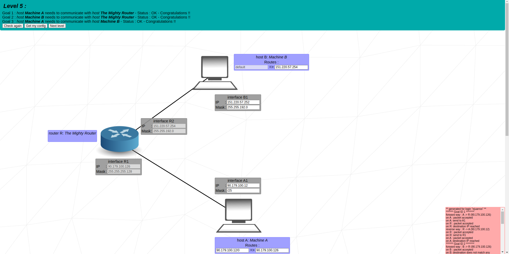

    

<h1 align="center">
    42 Net Practice
</h1>

Statement of the project (in [English](doc/en.subject.pdf))

## Introduction

NetPractice is a networking training project. It is an interactive exercise where you configure small networks (hosts, routers and masks) until all required machines can communicate with each other.
The project is about understanding and configuring IP networks.

## About the project

### What is a Network?

A **network** is a group of computers or devices that can communicate with each other. Devices connect through cables, Wi-Fi or other technologies, and exchange data using a set of **protocols** (rules).

Types of networks:
- **LAN (Local Area Network):** small, local (e.g., home, office).
- **WAN (Wide Area Network):** large, global (e.g., the internet).

### What is TCP/IP?

**TCP/IP** is the fundamental suite of protocols that run the internet.
- **IP (Internet Protocol):** handles addressing and routing packets between devices.
- **TCP (Transmission Control Protocol):** ensures reliable delivery of data.

### IPv4 Addresses

An **IPv4 address** uniquely identifies a device on a network. It is written as four numbers separated by dots. For example: `192.168.1.42`.

- Each number = 8 bits (0-255).
- Total size = 32 bits (4 x 8).

Addresses are divided into:
- **Network part** (which subnet the device belongs to).
- **Host part** (the specific device within that subnet).

### Subnet Masks

A **subnet mask** determines which part of the IP address is the **network** and which part is the **host**.

Example:
IP: 192.168.1.42
Netmask: 255.255.255.0

- `255.255.255.0` means the first 3 numbers (24 bits) identify the network
- So:
	- Network = `192.168.1.0`
	- Broadcast = `192.168.1.255`
	- Host range = `192.168.1.1` -> `192.168.1.254`

### CIDR Notation

Instead of writing the full netmask, we often use **CIDR (Classless Inter-Domain Routing)**.

- `/24` means: 24 bits for the network, 8 bits for hosts. (32 bits - 24 bits = 8 bits)
- `/30` means: 30 bits for the network, 2 bits for hosts. (32 bits - 30 bits = 2 bits)

### Switch

A **switch** is a device that connects multiple machines in the same network. 
- Works at **Layer 2** (Data Link layer).
- Forwards packets only within the **same subnet**.
- Doesn't change IP addresses.

It can be thought of as a "multi-plug extension cord" for networks.

### Router

A **router** connects **different networks** together.
- Works at **Layer 3** (Network layer).
- Has multiple interfaces, each with its own IP in its subnet.
- Uses **routing tables** to decide where to send packets.

### Routing Table

A **routing table** tells the router where to send packets that are not in the local subnet.
Each entry usually contains:
- **Destination**: the target network address.
- **Mask**: the subnet mask of the network.
- **Gateway** (next hop): the IP of the next router in the path.
- **Interface**: the local port to send packet through. (this will not be used in the exercises).

Example:
192.168.2.0/24 => 10.0.0.2
- To reach network `192.168.2.0/24`, forward packets to router `10.0.0.2`.

## Solved Exercises Examples

	
Level 1

	 

	
Level 2

	 

	
Level 3

	 

	
Level 4

	 

	
Level 5

	 

	
Level 6

	 

	
Level 7

	 

	
Level 8

	 

	
Level 9

	 

	
Level 10

	 

